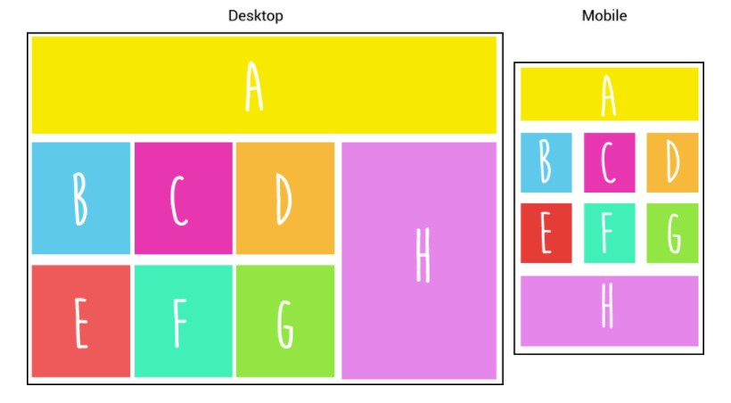

# ♡ Desktop to mobile ♡

En cada imagen vas a ver dos versiones: desktop (a la izquierda ) y mobile (a la derecha).

Replica la estructura desktop y modifícala a mobile como la imagen te lo dice, ¡tú puedes!

https://joyloove.github.io/desktop-mobile-3/.
